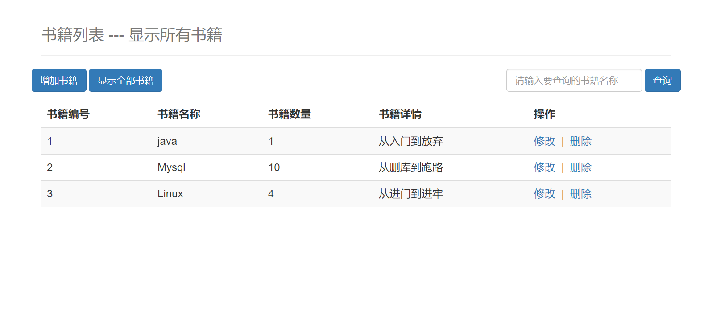

# ssmbuild

简单图书管理系统

## 依赖

- java 14
- maven
- spring
- spring-mvc
- mybatis
- mysql

## 界面

- localhost:8080

- localhost:8080/book/allBook

## 参考

- B站 [狂神说Java](https://www.bilibili.com/video/BV1aE41167Tu?p=17)